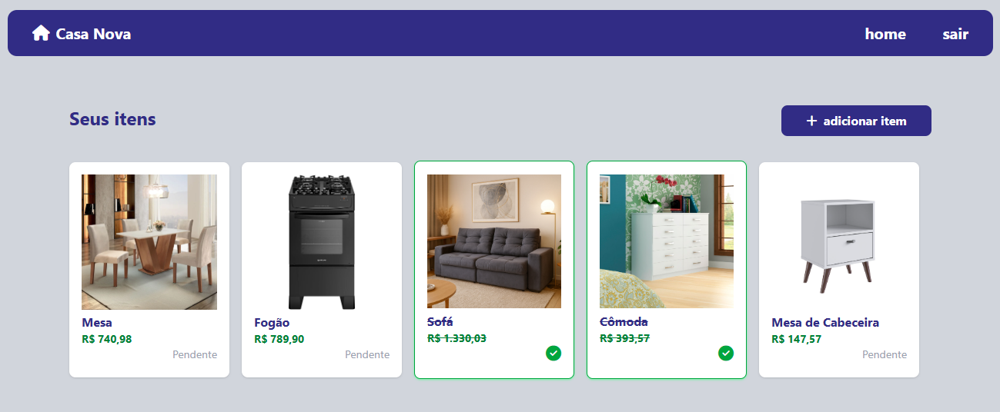

# 🏡 Casa Nova

Casa Nova é o meu primeiro projeto em PHP, desenvolvido com a arquitetura MVC.
A ideia é simples: ajudar pessoas a organizarem o enxoval de uma casa nova.



## Funcionalidades

- **Registro e login de usuário**.
- **Operações CRUD para os itens**.

## Tecnologias Usadas

- **PHP**.
- **MySQL**.
- **HTML, Tailwind, Font Awesome**.

## Como Rodar o Projeto

### Pré-requisitos

### Passos

1. Clone este repositório para sua máquina:
2. 
    ```bash
    https://github.com/geovana-miranda/casa-nova.git
    ```

3. Importe o banco de dados no seu MySQL (ex: via phpMyAdmin).
4. Acesse a pasta do projeto:

    ```bash
    cd casa-nova
    ```
    
5. Rode o projeto:

    ```bash
    php -S localhost:8080 -t public/
    ```

    O aplicativo estará disponível em [http://localhost:8080](http://localhost:8080).


## Funcionalidades Futuras

- Sugerir lista de itens.
- Exibir o orçamento com a soma dos preços dos itens que ainda não foram comprados.
